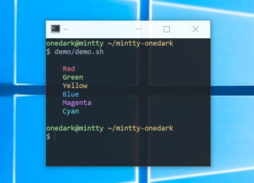

# Atom onedark color setting for mintty terminal



Base color from [geoffharcourt/one-dark.vim](https://github.com/geoffharcourt/one-dark.vim),
and adjust them for [mintty](https://github.com/mintty/mintty).

## Installation

Append content of `.minttyrc` into your `~/.minttyrc`

```bash
cat .minttyrc >> ~/.minttyrc
```

## Customization and rebuild

Saturation, Hue and Value are adjustable by modify `minttyrc.template`
and execute `node build.js`. (and, of course, `npm update` is required)

For example, `{red+h20-s10+v5}` means

- Base color is red (defined on `colors.cson`)
- Hue is rotated by 20
- Saturation is decreased by 10, and
- Value is increased by 5
